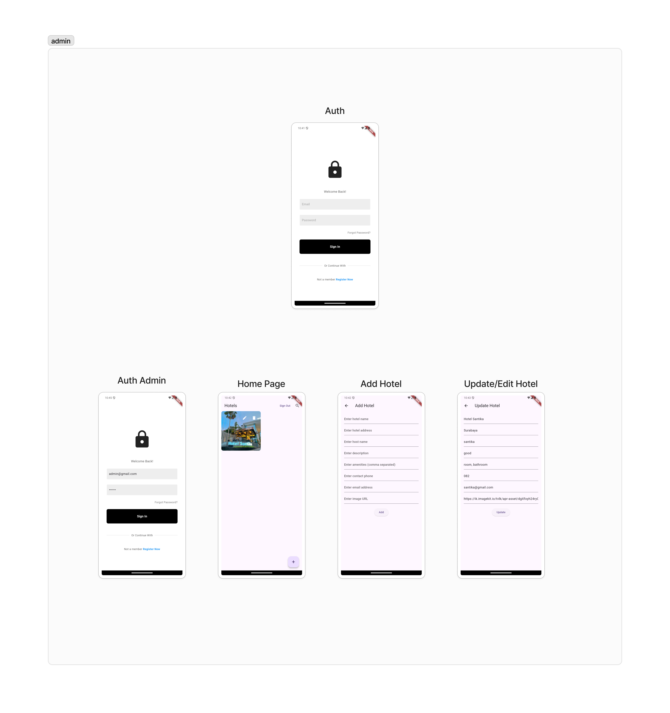
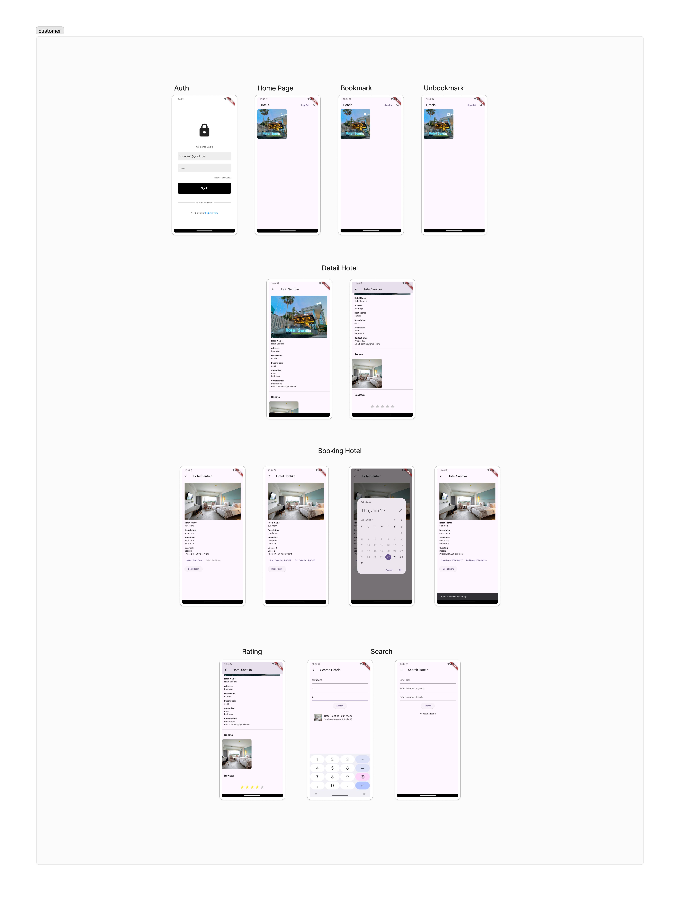

# Description

Our project involves the development of a hotel booking application using Android Studio with Flutter and Dart, aiming to provide a seamless and user-friendly platform for booking hotel reservations. Users can create accounts, log in securely, and browse a comprehensive catalog of hotels. The application features a search functionality allowing users to find hotels by name and location. Users can make reservations, specifying the dates and duration of their stay, with all user information, hotel details, and reservation data stored securely in Firebase. After booking, users receive an invoice detailing the reservation and total cost. The technology stack includes Flutter and Dart for the frontend and Firebase for backend authentication, data storage, and real-time database management, ensuring a convenient and efficient booking process.

# Features

# members + NRP
  ### Talitha Hayyinas Sahala (5025211263)
  ### Dzaky Hasbullah Wahyudi (5025211264)
  ### Franklin

  
# screenshot UI app in the readme (and references)

Reference : https://drive.google.com/drive/folders/1Ph3C-9Iqnp3_r4ko_Ic5rhFBHlt3fche?usp=drive_link 

# screenshot our UI app

### Admin Sides

### Customer Sides

